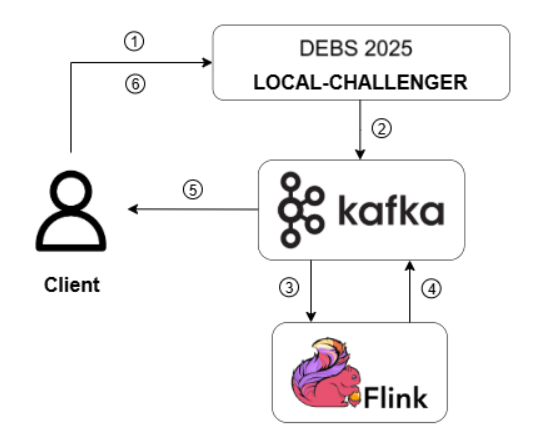

# 💡 SABD Project 2 – A.Y. 2024/2025

**Course:** Systems and Architectures for Big Data (SABD)  
**Team:** Matteo Basili, Adriano Trani  
**Professors:** Valeria Cardellini, Matteo Nardelli  
**Code and report submission:** July 8, 2025  
**Oral presentation:** July 10/11, 2025

---

## 📌 Project Objectives

This project aims to develop a real-time distributed stream-processing application for monitoring the **Laser Powder Bed Fusion (L-PBF)** additive manufacturing process. Using **Apache Flink**, the system analyzes thermal (OT) images layer by layer to estimate defect probabilities during object creation, enabling early detection and quality assurance before production completes.

---

## 🛠️ Technology Stack

- **Apache Flink** (for real-time stream processing)  
- **Apache Kafka** (for message brokering between components)
- **Docker & Docker Compose** (for containerization and deployment)  
- **Python** (main programming language)

---

## 🧱 Architectural Diagram

---

## 📁 Repository Structure

| Folder / File                    | Description                                                                 |
|---------------------------------|-----------------------------------------------------------------------------|
| `Report/`                       | Technical report in IEEE proceedings format                                |
| `Results/`                      | Query results in CSV format                                                |
| `Results/analysis/`             | Experimental processing times                                              |
| `Results/csv/`                 | CSV output of queries Q1, Q2, Q3                                           |
| `client/`                       | Kafka client to interface with the Local Challenger and Flink pipeline      |
| `csv-writer/`                   | Scripts related to the memorization of the queries'results as a csv file|
| `flink/`                        | Scripts related to Flink initialization and queries computation                                |
| `kafka/init/`                   | Scripts for Kafka initialization and topic creations                                |
| `local-challenger/`             | Provided dataset                                |
| `scripts/`                      | Scripts for ingestion, processing (Spark RDD/DataFrame/SQL), export, and charts |
| `specification/`                | Full project specification provided by professors                         |
| `.gitattributes`                | Necessary for loading the file local-challenger/gc25cdocker.tar                   |
| `docker-compose.yml`           | Complete cluster configuration (Flink, Kafka, Local Challenger, etc.)                  |

---

## 🤝 Contributors

- **Matteo Basili** – [GitHub Profile](https://github.com/MatteoBasili)
- **Adriano Trani** – [GitHub Profile](https://github.com/AdrianoTrani)
