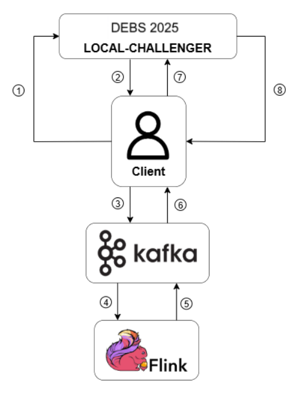

# 💡 SABD Project 2 – A.Y. 2024/2025

**Course:** Systems and Architectures for Big Data (SABD)  
**Team:** Matteo Basili, Adriano Trani  
**Professors:** Valeria Cardellini, Matteo Nardelli  
**Code and report submission:** July 8, 2025  
**Oral presentation:** July 10/11, 2025

---

## 📌 Project Objectives

This project aims to develop a real-time distributed stream-processing application for monitoring the **Laser Powder Bed Fusion (L-PBF)** additive manufacturing process. Using **Apache Flink**, the system analyzes thermal (OT) images layer by layer to estimate defect probabilities during object creation, enabling early detection and quality assurance before production completes.

---

## 🛠️ Technology Stack

- **Apache Flink** (for real-time stream processing)  
- **Apache Kafka** (for message brokering between components)
- **Docker & Docker Compose** (for containerization and deployment)  
- **Python** (main programming language)

---

## 🧱 Architectural Diagram

[](Report/sabd_project2_architectural_diagram.png)

---

## 📁 Repository Structure

| Folder / File                    | Description                                                                 |
|---------------------------------|-----------------------------------------------------------------------------|
| `Report/`                       | Technical report in IEEE proceedings format                                |
| `Results/`                      | Query results                                                       |
| `Results/analysis/`             | Performance metrics (latency & throughput)                                              |
| `Results/csv/`                  | CSV output of queries Q1, Q2, Q3                                           |
| `client/`                       | Kafka client to interface with the Local Challenger and Flink pipeline      |
| `csv-writer/`                   | Writes query outputs to CSV                                                   |
| `flink/`                        | Flink queries and Docker cluster configuration                                |
| `kafka/init/`                   | Used for Kafka topic creation                                |
| `local-challenger/`             | LOCAL-CHALLENGER resources.                                |
| `scripts/`                      | Execution, cleanup, and analysis scripts                                |
| `specification/`                | Full project specification provided by professors                         |
| `.gitattributes`                | Required to run the LOCAL-CHALLENGER in the repository                   |
| `docker-compose.yml`            | Complete cluster configuration (Flink, Kafka, Local Challenger, etc.)                  |

---

## ⚙️ Setup and Execution

### 🔧 Prerequisites

> ⚠️ The project runs **exclusively on Linux systems**.  
> ❌ Compatibility on Windows is not guaranteed.

Make sure you have the following installed:

- **Docker** ≥ 20.10  
- **Docker Compose** ≥ 1.29  
- [**Python**](https://www.python.org/) (recommended: version 3.8+)  

Install the necessary Python libraries with:

```bash
pip install pandas requests openpyxl
```

Install **Git Large File Storage (LFS)** (it is needed because the project uses file bigger than 100 MB)

```bash
curl -s https://packagecloud.io/install/repositories/github/git-lfs/script.deb.sh | sudo bash
sudo apt-get install git-lfs
```

### 🚀 Start environment

```bash
git lfs install
git clone https://github.com/MatteoBasili/sabd-progetto2-2024_25.git
cd sabd-progetto2-2024_25
git checkout main
docker image load -i local-challenger/gc25cdocker.tar
docker compose up --build -d
```

Access services at:
- **Apache Flink UI:** http://localhost:8081
- **LOCAL-CHALLENGER Dashboard:** http://localhost:8866/dash

### 📦 Pipeline execution

Run the complete L-PBF processing pipeline (from image ingestion to query result export) using the script `run_all.py`:
> 📂 **The script must be run from the project's root directory.**
```bash
python3 ./scripts/run_all.py
```

The script performs the following steps:
1. Creates the required Kafka topics via the `topic-init` container
2. Starts the Flink job in detached mode and waits until all operators are fully running
3. Launches the `csv-writer` container in the background to write query results to CSV
4. Starts the `l-pbf-client` container to request data from the LOCAL-CHALLENGER and stream it into the pipeline
5. The output of Query 3 is automatically sent back to the LOCAL-CHALLENGER for benchmarking and performance evaluation

> 🛠️ **Optional:** use the `--limit N` argument to restrict the number of image batches processed (useful for quick tests).
> Example:
```bash
python3 ./scripts/run_all.py --limit 50
```

---

## 📊 Dataset

**Sources:** [Official README](http://www.ce.uniroma2.it/courses/sabd2425/project/README.md), [Source archive (without database)](http://www.ce.uniroma2.it/courses/sabd2425/project/gc25-chall.tgz), [TIFF dataset (OT images)](http://www.ce.uniroma2.it/courses/sabd2425/project/gc25-chall-data.tgz)  
This project uses the dataset from the **ACM DEBS 2025 Grand Challenge**, which contains thermal TIFF images of a powder bed in 3D printing. The data stream is served by a REST server called **Local-Challenger** following OpenAPI specs.
Each data element corresponds to a **tile** of a **layer** with fields:

- `seq_id`: sequence number
- `print_id`: object print ID
- `tile_id`: tile ID within the layer
- `layer`: layer index (z-coordinate)
- `tiff`: 16-bit thermal image tile

Tiles represent temperature distribution to detect anomalies and defects in real time. The dataset is split into tiles and layers to enable parallel processing and simulate multi-sensor data acquisition.

---

## 🔍 Query Overview

The application processes image data through a 4-stage pipeline:  
  
**1. Threshold-based analysis**  
**2. Windowing across layers**  
**3. Outlier detection**  
**4. Outlier clustering**  

Each query corresponds to specific stages in the pipeline and produces structured output. Below is a summary of each query:

### 🔹 Q1 – Threshold-Based Filtering

- For each tile, detect points with temperature below 5 000 (void) or above 65 000 (saturated)
- Count the number of saturated points
- Discard both void and saturated points for the following queries
- Output: `seq_id, print_id, tile_id, saturated`
- ⚠️ Output is not sent to the Local Challenger

### 🔹 Q2 – Outlier Detection with Sliding Window

- Maintain a sliding window of the last 3 layers for each tile
- Compute the local temperature deviation for each point in the most recent layer
- Mark as outliers the points where the deviation exceeds 6 000
- Return the top-5 outliers (by highest deviation) for each tile
- Output: `seq_id, print_id, tile_id, p1, dp1, ..., p5, dp5`
- ⚠️ Output is **not** sent to the Local Challenger

### 🔹 Q3 – Clustering of Outliers

- Cluster outliers (from Q2) using DBSCAN with Euclidean distance
- Return the centroids of the clusters (x, y, and size)
- Include saturated point count for each tile
- Output: `seq_id, print_id, tile_id, saturated, centroids`
- ✅ Output must be sent to the Local Challenger for evaluation

---

## 📈 Performance Analysis
For each query, we conducted an experimental analysis of processing times based on real execution logs.
- **Metrics collected:** end-to-end latency and throughput, extracted from application logs using a custom logging format.
- **Statistical evaluation:** average, max, and percentile latencies (50th, 95th, 99th) computed from parsed logs over multiple batch sizes (100, 200, 300).
- **Throughput analysis:** defined as number of batches processed divided by the total time interval between the first and last processed batch.
- **Reproducibility:** each run was performed under controlled conditions, with no background load.

---

## 📤 Output and Results

- All CSV results are in:
> 📂 _Results/csv/_
- Statistical analysis of performance metrics are in::
> 📂 _Results/analysis/_

---

## 📑 Documentation

- 📄 **Technical report**: `Report/sabd_project2_report_basili_trani_2024_25.pdf` (IEEE format)
- 🖼️ **System architecture**: included in the report (PDF)

---

## 🤝 Contributors

- **Matteo Basili** – [GitHub Profile](https://github.com/MatteoBasili)
- **Adriano Trani** – [GitHub Profile](https://github.com/AdrianoTrani)
